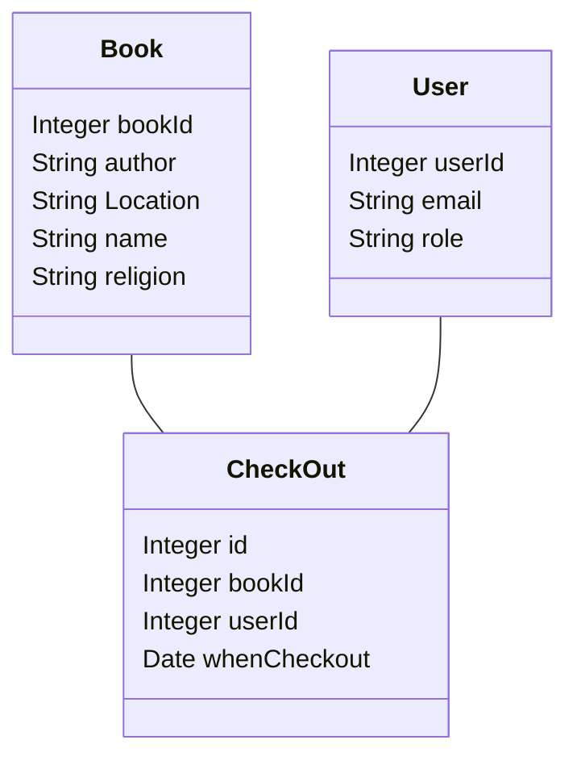
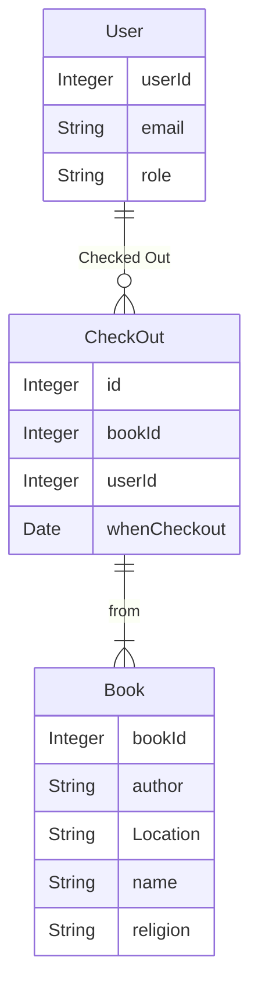

## What you learned from the customer
- The customer requires a database such that we will have all the above information listed in an organized manner and is easily accessible.
  - we can :
    -  can filter by related words (by typing in a textbox for fields).
    - add/delete a row/book through some interface through admin access to DB as a department coordinator
    - have UI to store if the book is lended, and returned (and by whom), 
- most people who will borrow/return will be profs (so need to make sure that it is visible to them).
- For now, we don't want students to access it because in the past they found the books, took them and never returned, so this needs to be serving ADC (our customer) as admin

## Class Diagrams

## The preliminary ER-diagram,

## The Data
We received the data in the form of Excel sheets. It contained various sheets with different subsets of information from all the attributes. The data will definitely need cleaning.
#### What is it
The data is about the religious books stored by the religion department. Each book already has a name, author, topic, Bookcase, and shelf number where it is stored.
#### In what format
We were given an Excel file with many sheets divided by religion that the books are each associated to.
#### How much data
We have around 600 books.
#### Do we have access
Yes, we have access to the Excel file that the religion department gave us.
#### Does it Need cleaning
Yes, it does need a lot of cleaning.

## Generating Schema:
Based on our ER-diagram, the draft of database schema can be roughly outlined as:

```sql
CREATE TABLE User (
    userId INTEGER PRIMARY KEY,
    email VARCHAR(255) UNIQUE NOT NULL,
    role VARCHAR(50) NOT NULL
);

CREATE TABLE Book (
    bookId INTEGER PRIMARY KEY,
    author VARCHAR(255) NOT NULL,
    Location VARCHAR(255) NOT NULL,
    name VARCHAR(255) NOT NULL,
    religion VARCHAR(50) NOT NULL
);

CREATE TABLE CheckOut (
    id INTEGER PRIMARY KEY,
    bookId INTEGER REFERENCES Book(bookId),
    userId INTEGER REFERENCES User(userId),
    whenCheckout DATE NOT NULL
);
```

## Finalizing Tech Stack:

#### Backend:
- **Database**: PostgreSQL (as mentioned).
- **Server**:  Linux server.
- **Backend Framework**: NextJS, Flask or Django (Python) would be suitable for this. Flask is lightweight and easier to set up, while Django is more robust and comes with an admin interface out of the box.

#### Frontend:
- **Framework/Library**: React.js or Vue.js. React.js is widely used and has a large community, while Vue.js is easier to pick up for beginners.
- **UI Library**: MantineUI, TailwindCSS Material-UI (for React) or Vuetify (for Vue) to speed up the development process with pre-built UI components.

#### API for Publisher:
As we don't know which web API to use for publishers, we might want to consider Google Books API or Open Library API. These APIs can provide book details based on ISBN or title.

## Data Cleaning:
- Load the Excel sheets into a tool like Pandas in Python.
- Examine data for missing values, duplicates, or inconsistent formats.
- Handle any outliers or errors in the data.
- Normalize the data (e.g., ensuring consistent casing, date formats, etc.).

## Development:

#### Backend:
- Set up the database and schema.
- Create API endpoints for CRUD operations on books, users, and checkout logs.
- Implement filtering functionality.
- Add authentication and authorization to ensure only admins can add/delete and everyone else has read-only access.
  
#### Frontend:
- Create a dashboard UI for viewing books, users, and checkout logs.
- Implement filtering functionality on the UI.
- Add interfaces for adding/deleting books and users.
- Create UI components to handle book lending and returning.
  
## Extended Goals:
- Integrate with the chosen publisher API to fetch book details.
- Add Single Sign-On (SSO) functionality using Amherst emails.
- Allow the ADC to input a list of emails to grant access.

## Testing:
- Test CRUD operations.
- Implement unit tests
- Test filtering functionality.
- Test user roles (admin vs regular user).
- Test the extended goals' features.

## Deployment:
- Deploy the backend on the Linux server.
- Deploy the frontend on a suitable hosting provider or the same server.

## Documentation & Handover:
- Document the system, including API endpoints, database schema, and any other relevant details.
- Provide training or a walkthrough to ADC or any other relevant stakeholders.

## What don't we know
- Web API for Publisher
- The needed UI and UX design
- The Tech Stack to be used for specifics (except Linux server and PostgreSQL, which will be provided by the professor)
  
## Next Steps:
1. Confirm the tech stack.
2. Start the data cleaning process.
3. Initiate the development process, beginning with the backend.
4. Regularly test and iterate based on feedback.
5. Once stable, deploy and document the system.
