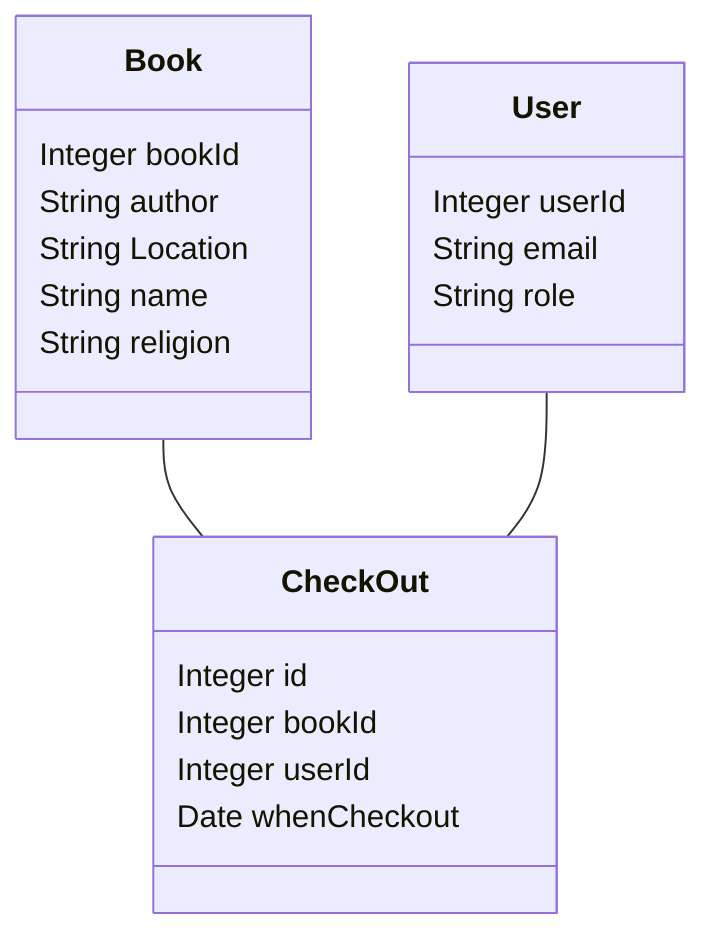
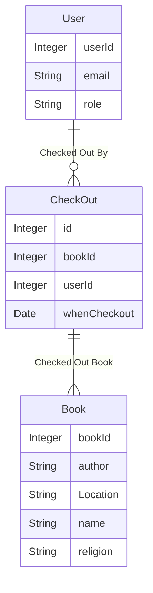

## What you learned from the customer
- The customer requires a database such that we will have all the above information listed in an organized manner and is easily accessible.
  - we can :
    -  can filter by related words (by typing in a textbox for fields).
    - add/delete a row/book through some interface through admin access to DB as a department coordinator
    - have UI to store if the book is lended, and returned (and by whom), 
- most people who will borrow/return will be profs (so need to make sure that it is visible to them).
- For now, we don't want students to access it because in the past they found the books, took them and never returned, so this needs to be serving ADC (our customer) as admin

## Class Diagrams

## The preliminary ER-diagram,

## The Data
We received the data in the form of Excel sheets. It contained various sheets with different subsets of information from all the attributes. The data will definitely need cleaning.
### What is it
The data is about the religious books stored by the religion department. Each book already has a name, author, topic, Bookcase, and shelf number where it is stored.
### In what format
We were given an Excel file with many sheets divided by subject.
### How much data
We have around 600 books.
### Do we have access
Yes, we have access to the Excel file that the religion department gave us.
### Does it Need cleaning
Yes, it does need a lot of cleaning
## Extended goals
- To use web APIs to find publishers name (and maybe summary as well) of the books being entered and populating them, 
- This can be done by adding or removing users with Amherst emails through Single Sign On (SSO). 
- The ADC can manually enter a list of Amherst email addresses into a text box, and the backend will allow them to grant read-only access to a database. 

## What don't we know
- 
## Next steps.
- Generating schema.
- Finalizing tech stack.
