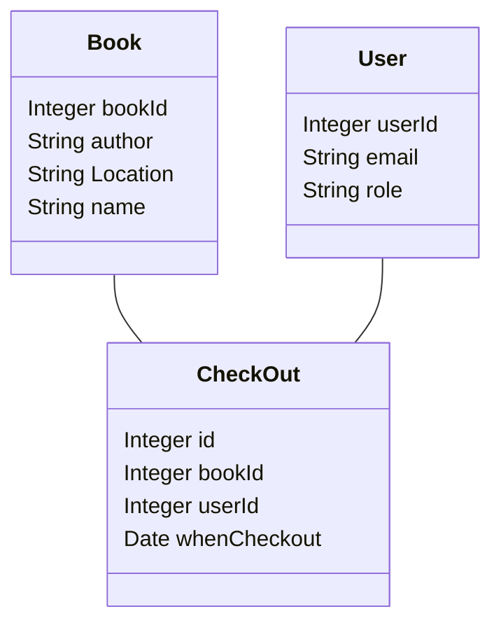

## What you learned from the customer
## Class Diagrams

## The preliminary ER-diagram,
## The Data
We received the data in form of Excel sheets. It contained various sheets with different subsets of information from all the attributes.
### What is it
### In what format
### How much data
### Do we have access
### Does it Need cleaning
## What don't we know
## Next steps.
