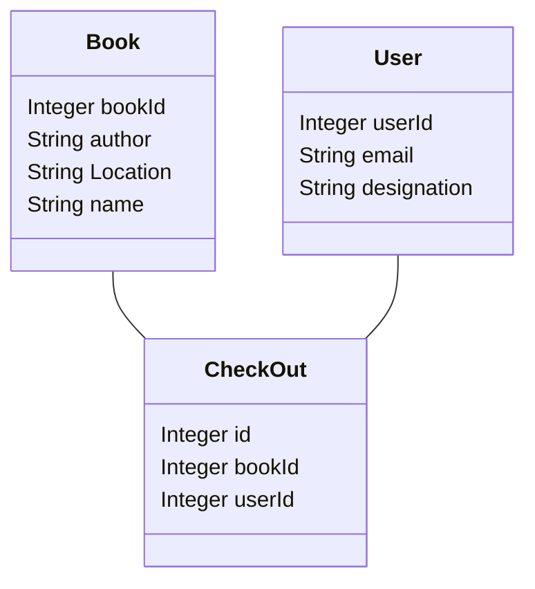

## What you learned from the customer
## The preliminary ER-diagram,

## The Data
### What is it
### In what format
### How much data
### Do we have access
### Does it Need cleaning
## What don't we know
## Next steps.