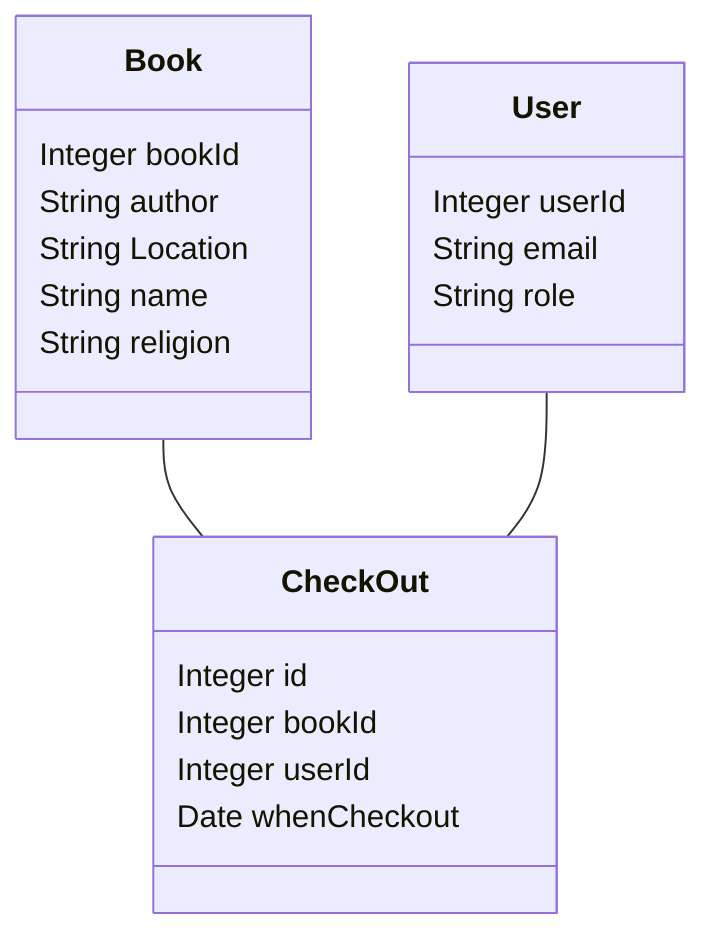
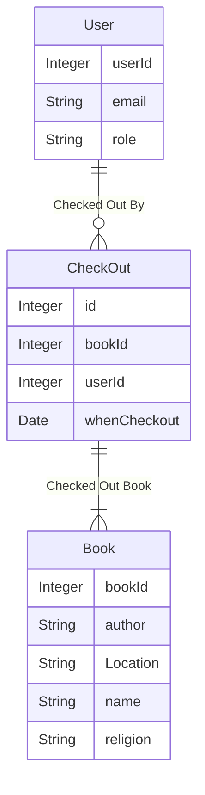

## What you learned from the customer

## Class Diagrams

## The preliminary ER-diagram,

## The Data
We received the data in the form of Excel sheets. It contained various sheets with different subsets of information from all the attributes. The data will definitely need cleaning.
### What is it
The data is about the religious books stored by the religion department. Each book already has a name, author, topic, Bookcase, and shelf number where it is stored.
### In what format
We were given an Excel file with many sheets divided by subject.
### How much data
We have around 600 books.
### Do we have access
Yes, we have access to the Excel file that the religion department gave us.
### Does it Need cleaning
Yes, it does need a lot of cleaning
## What don't we know

## Next steps.
