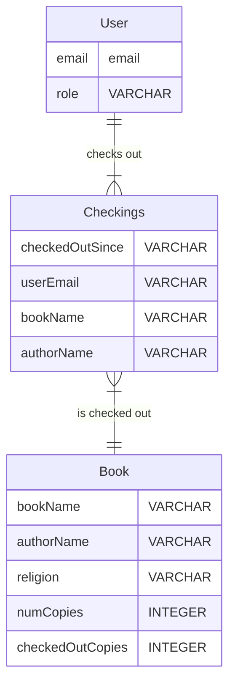

## What we learned from the customer
- The customer requires a database such that we will have all the information related to the religion library and the available books in an organized and easily accessible manner.
- We are planning to implement the following features:
    - Can filter by related words (by typing in a textbox for fields).
    - Add/delete a row/book through some interface through admin access to DB as a department coordinator.
    - Have UI to store if the book is lended, and returned (and by whom). 
- Most people who will borrow/return will be profs (so need to make sure that it is visible to them).
- For now, we don't want students to access it because in the past they found the books, took them and never returned, so this needs to be serving ADC (our customer) as admin

## The Revised ER-diagram,


## The Data
We received the data in the form of Excel sheets. It contained various sheets with different subsets of information from all the attributes. The data will definitely need cleaning. The data is about the religious books stored by the religion department. Each book already has a name, author, topic, Bookcase, and shelf number where it is stored. We have around 600 books.

### Data restrictions:
- User can't check out multiple copies of the same book simulteanously

## Generating ER Schema:
Based on our ER-diagram, the draft of database schema can be roughly outlined as: (Please note that "--" is a comment in SQL, which is not executed)

```sql
-- User Table
CREATE TABLE User (
    email VARCHAR(255) PRIMARY KEY,
    role VARCHAR(50) NOT NULL
);

-- Book Table with composite primary key
CREATE TABLE Book (
    bookName VARCHAR(255) NOT NULL,
    authorName VARCHAR(255) NOT NULL,
    religion VARCHAR(50) NOT NULL,
    shelf VARCHAR(25) NOT NULL,
    wing VARCHAR(100) NOT NULL,
    numCopies INTEGER NOT NULL,
    checkedOutCopies INTEGER NOT NULL,
    PRIMARY KEY (bookName, authorName)
);

-- Checkings Table
CREATE TABLE Checkings (
    checkedOutSince VARCHAR(255),
    userEmail VARCHAR(255) NOT NULL,
    bookName VARCHAR(255) NOT NULL,
    authorName VARCHAR(255) NOT NULL,
    FOREIGN KEY (userEmail) REFERENCES User(email),
    FOREIGN KEY (bookName, authorName) REFERENCES Book(bookName, authorName)
);
```

## Finalizing Tech Stack:

#### Backend:
- **Database**: PostgreSQL (as mentioned, and installed).
- **Server**:  Linux server.
- **Backend Framework**: NextJS.

#### Frontend:
- **Framework/Library**: React.js, Nx.dev
- **UI Library**: TailwindCSS, Material-UI (for React). This is to speed up the development process with pre-built UI components.

#### API for Publisher:
- Google Books API / Open Library API. These APIs can provide book details based on ISBN or title.

## Data Cleaning:
- **[DONE]** Load the Excel sheets into a tool like Pandas in Python.
- **[DONE]** Examine data for missing values, duplicates, or inconsistent formats.
- **[DONE]** Handle any outliers or errors in the data.
- **[DONE]** Normalize the data (e.g., ensuring consistent casing, date formats, etc.).

## Development:

#### Backend:
- **[DONE]** Set up the database and schema.
- **[DONE]** Create API endpoints for CRUD operations on books, users, and checkout logs.
- **[DONE]** Implement filtering functionality.
- Add authentication and authorization to ensure only admins can add/delete and everyone else has read-only access.
  
#### Frontend:
- **[DONE]** Create a dashboard UI for viewing books, users, and checkout logs.
- **[DONE]** Implement filtering functionality on the UI.
- **[DONE]** Add interfaces with the database for adding/deleting books and users.
- **[DONE]** Create UI components to handle book lending and returning.
- Finalize and Connect all the UI components together and link them to backend
  
## Extended Goals:
- Integrate with the chosen publisher API to fetch book details.
- Add Single Sign-On (SSO) functionality using Amherst emails.
- Allow the ADC to input a list of emails to grant access.

## Testing:
- Test CRUD operations.
- Implement unit tests
- Test filtering functionality.
- Test user roles (admin vs regular user).
- Test the extended goals' features.

## Deployment:
- Deploy the backend on the Linux server.
- Deploy the frontend on a suitable hosting provider or the same server.

## Documentation & Handover:
- Document the system, including API endpoints, database schema, and any other relevant details.
- Provide training or a walkthrough to ADC or any other relevant stakeholders.

## Open Questions:
- How to integrate frontend and backend well while binding it with Linux server?
- How to deploy it to a website so that it is stable for use?

## Next Steps:
1. Finish Remaining Integration and parts of frontend and backend
2. Regularly test and iterate based on feedback.
3. Once stable, deploy and document the system.
